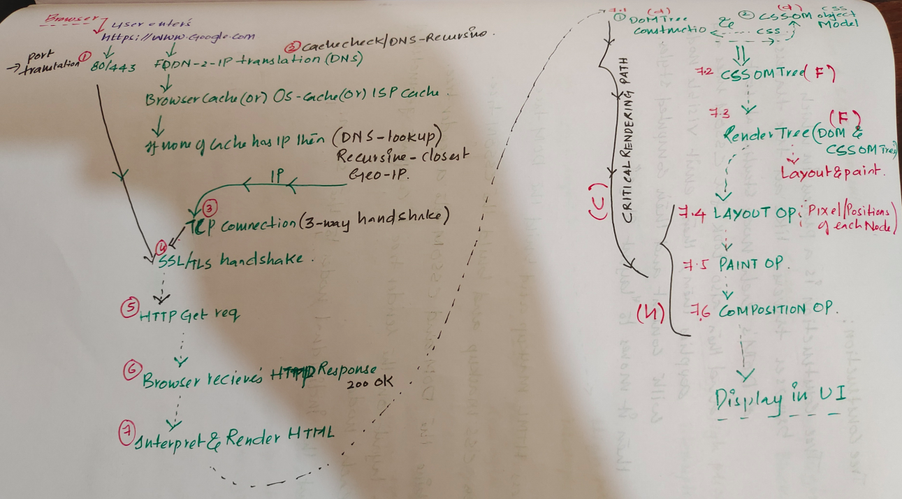

# Week1-Assignment-1.1
> How Browsers work?.

## Table of Contents
- [Week1-Assignment-1.1](#week1-assignment-11)
  - [Table of Contents](#table-of-contents)
  - [a. What is the main functionality of the browser?](#a-what-is-the-main-functionality-of-the-browser)
  - [b. High Level Components of a Browser.](#b-high-level-components-of-a-browser)
  - [c. Rendering engine and its use.](#c-rendering-engine-and-its-use)
  - [d. Parsers (HTML, CSS, etc).](#d-parsers-html-css-etc)
  - [e. Script Processors.](#e-script-processors)
  - [f. Tree construction.](#f-tree-construction)
  - [g. Order of script processing.](#g-order-of-script-processing)
  - [h. Layout and Painting.](#h-layout-and-painting)
  - [Finally "How Browsers work in a single image":](#finally-how-browsers-work-in-a-single-image)

  ## a. What is the main functionality of the browser?
- Display the UI to the users is the key functionality of browser.
- This includes HTML pages on web, Applications.
- This can include content that static and dynamic.
- In case dynamic content it can use JS, AJAX and content could fetched or hosted on Servers across the globe.

## b. High Level Components of a Browser.
- Architecture/Components of browser include:
- 1. UI.
- 2. Browser Engine.
- 3. Data Persistence.
- 4. Rendering Engine.
- 5. Networking
- 6. UI Backend.
- 7. JS Interpreter.
- 

## c. Rendering engine and its use.
- Its a software component that draws structured text from a document (HTML).
- And then it formats it properly based on the given style declarations.
- Examples of Rendering engines are : Blink, Gecko, EdgeHTML, WebKit.
- 

## d. Parsers (HTML, CSS, etc).
- It's a lightweight parser(HTML/CSS) written in C.
- It allows applications to prepare an HTML document for rendering.
- HTMLCSS parser is extremely portal.

## e. Script Processors.
- Script processors basically helps in defining High to low Order of Script process:
- 

## f. Tree construction.
- Tree construction is a process in which browsers traverse like a tree traversal process via DOM tree, DOM's each node starting from at the root.
- As it traverses DOM's each node, it also looks CSSOM rules and applies them, then emit visible node with content, computed styles, finally moving into Layout stage.

## g. Order of script processing.
- 1. script tag head (high priority, blocks parsers) > 2. link reload or script async tag or script type = module async (high priority, interrupts parser)  > continue
- 3. script async (high priority, interrupt parser) > 4. script defer (very low, runs after script tag at the end of body tag) > continue
- 4. script tag at the end of body tag (low waits parser ends) > 5. script defer tag at the end of body ( very low, after body tag). continue
- 5. link rel=prefetch + script in the next-page navigation ---> Depends on when an dhow the script is consumed.
- 

## h. Layout and Painting.
- Once the render-tree which is the combination of CSSOM and DOM trees, layout computation starts.
- Layout computation does the compute of exact position and size of each object within a respective viewport.
- Final stage after the Layout is Painting also called as Rasterizing.
- Paiting is basically converts each node in the render tree to actual prixels on the screen.
- **** VVIMP If either DOM or CSSOM were modified you will have to repeat the whole process.
- 

## Finally "How Browsers work in a single image":

- 
